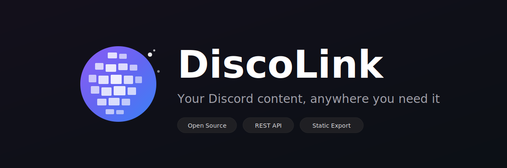

<p align="center">
  
</p>

<p align="center">
  <b>Your Discord content, anywhere you need it.</b>
</p>

<p align="center">
  <a href="https://opensource.org/licenses/MIT"></a>
  <a href="https://nodejs.org/"></a>
  <a href="https://www.typescriptlang.org/"></a>
  <a href="https://discord.js.org/"></a>
</p>

<p align="center">
  <a href="https://discolink.pages.dev">Website</a> •
  <a href="https://discolink.pages.dev/docs">Documentation</a> •
  <a href="https://discolink.pages.dev/quickstart">Quick Start</a> •
  <a href="https://discolink.pages.dev/templates">Templates</a>
</p>

---

## 🤔 What is DiscoLink?

DiscoLink syncs your Discord forums and channels to a database you control. Build FAQ pages, knowledge bases, changelogs, or blogs from your Discord content.

```
Discord → Bot syncs content → Database → REST API / Static Export → Your Website
```

**Use it for:**
- 💬 **FAQ Pages** — Turn resolved help threads into searchable FAQs
- 📚 **Knowledge Base** — Organize forum content into documentation
- 📋 **Changelog** — Auto-publish release notes from announcements
- ✍️ **Blog** — Transform discussions into blog posts

---

## ✨ Features

| Feature | Status |
|---------|:------:|
| Forum channel sync | ✅ |
| Text channel sync | ✅ |
| Announcement channel sync | ✅ |
| Real-time sync via bot | ✅ |
| REST API | ✅ |
| Webhooks | ✅ |
| RSS / Atom feeds | ✅ |
| Full-text search (FTS5) | ✅ |
| Static site export CLI | ✅ |
| Official templates | ✅ |
| Self-hosted | ✅ |
| Edge deployment (Cloudflare) | ✅ |
| Privacy controls | ✅ |
| Consent-based syncing | ✅ |
| MIT License | ✅ |
| **100% Free** | ✅ |

---

## 🚀 Quick Start

```bash
# Clone and install
git clone https://github.com/KevinTrinh1227/discolink.git
cd discolink && pnpm install

# Configure
cp .env.example .env
# Add your Discord bot token and credentials

# Run
pnpm db:push && pnpm dev
```

📖 **[Full Setup Guide →](https://discolink.pages.dev/quickstart)**

---

## 🛠️ Three Ways to Use

| Approach | Best For |
|----------|----------|
| **🔗 REST API** | Custom apps, dashboards, integrations |
| **📦 Static Export** | Simple sites, no server needed |
| **🎨 Templates** | Quick start with pre-built designs |

---

## 📦 Templates

Ready-to-use templates for common use cases:

| Template | Description |
|----------|-------------|
| [FAQ](packages/templates/faq) | Searchable FAQ from resolved threads |
| [Knowledge Base](packages/templates/knowledge-base) | Organized documentation |
| [Changelog](packages/templates/changelog) | Release notes timeline |
| [Blog](packages/templates/blog) | Blog posts from discussions |

---

## 🔒 Privacy First

- **Consent-based** — Users can opt out of syncing
- **Self-hosted** — Your data stays on your infrastructure
- **No tracking** — We don't collect any data

---

## 📚 Documentation

| Resource | Link |
|----------|------|
| Getting Started | [discolink.pages.dev/quickstart](https://discolink.pages.dev/quickstart) |
| API Reference | [discolink.pages.dev/docs/api](https://discolink.pages.dev/docs/api) |
| CLI Reference | [discolink.pages.dev/docs/cli](https://discolink.pages.dev/docs/cli) |
| Templates | [discolink.pages.dev/templates](https://discolink.pages.dev/templates) |

---

## 🤝 Contributing

Contributions welcome! See the [Contributing Guide](https://discolink.pages.dev/docs/guides).

---

## 📄 License

MIT — Use it however you want.

---

<p align="center">
  <sub>Built by <a href="https://github.com/KevinTrinh1227">Kevin Trinh</a> • Not affiliated with Discord Inc.</sub>
</p>
